# Terraform vs Heat: Despliegue de infraestructura 3 capas en OpenStack

###### Por Juan Manuel Payán Barea / jpaybar

st4rt.fr0m.scr4tch@gmail.com

---

## 📌 Descripción general

Este proyecto demuestra el despliegue automatizado de una **infraestructura de red en 3 capas** sobre OpenStack usando **Terraform**, y lo compara con el mismo despliegue usando **OpenStack Heat**.

La infraestructura consiste en tres redes aisladas, tres máquinas virtuales, routers, grupos de seguridad y una IP flotante — todo desplegado y gestionado como código.

El objetivo es mostrar las ventajas de Terraform sobre Heat para la automatización de infraestructura, con foco en modularidad, reutilización e idempotencia.

---

## 🧪 Entorno

### 🖥️ Sistema anfitrión

- SO: Ubuntu 24.04
- CPU: AMD Ryzen 5 3600 (6 núcleos)
- RAM: 32 GB
- Almacenamiento: SSD NVMe

### ☁️ OpenStack

- Plataforma: OpenStack 2024.1 (Caracal)
- Despliegue: Sunbeam (nodo único sobre KVM)

### 🔧 Herramientas

- Terraform: 1.14.7
- Proveedor Terraform OpenStack: ~> 1.54
- OpenStack Heat: incluido en OpenStack 2024.1 (Caracal)
- Python OpenStack Client: última versión

---

## 🏗️ Arquitectura

La infraestructura sigue una **arquitectura clásica de 3 capas**:

| Capa       | Servidor | Red                   | Rol                                |
| ---------- | -------- | --------------------- | ---------------------------------- |
| Frontend   | server1  | net1 (192.168.1.0/24) | Proxy inverso Nginx (público)      |
| Aplicación | server2  | net2 (192.168.2.0/24) | Apache + PHP + WordPress (interno) |
| Base datos | server3  | net3 (192.168.3.0/24) | MySQL (interno)                    |

```
Internet
    |
    | (IP flotante)
    |
[ server1 - net1 ] ── Proxy inverso Nginx
    |
    | (192.168.1.0/24 → 192.168.2.0/24)
    |
[ server2 - net2 ] ── Apache + PHP
    |
    | (192.168.2.0/24 → 192.168.3.0/24)
    |
[ server3 - net3 ] ── MySQL
```

### 🔒 Grupos de seguridad

- **sg_server1**: SSH, ICMP, HTTP (80) y HTTPS (443) desde `0.0.0.0/0` (público). El puerto 80 permanece abierto para la redirección HTTP→HTTPS.
- **sg_server2**: SSH, ICMP, HTTPS (443) solo desde `192.168.1.0/24`
- **sg_server3**: SSH, ICMP, MySQL (3306) solo desde `192.168.2.0/24`

---

## 🔧 ¿Qué es Terraform?

[Terraform](https://www.terraform.io/) es una herramienta de **Infraestructura como Código (IaC)** de código abierto desarrollada por HashiCorp. Permite definir infraestructura en un lenguaje declarativo (HCL) y gestionarla en múltiples proveedores cloud.

Características principales:

- **Multi-cloud**: AWS, GCP, Azure, OpenStack y más
- **Modular**: módulos reutilizables para cualquier componente de infraestructura
- **Idempotente**: se puede aplicar el mismo plan múltiples veces de forma segura
- **Con estado**: rastrea el estado real de la infraestructura mediante `terraform.tfstate`

---

## 🔥 ¿Qué es Heat?

[OpenStack Heat](https://docs.openstack.org/heat/latest/) es el **servicio nativo de orquestación** de OpenStack. Usa plantillas en formato YAML para definir y desplegar recursos cloud dentro de un entorno OpenStack.

Características principales:

- **Nativo OpenStack**: profundamente integrado con todos los servicios de OpenStack
- **Basado en stacks**: los recursos se agrupan en stacks
- **Orientado a plantillas**: usa el formato HOT (Heat Orchestration Template)

---

## 📂 Estructura del proyecto

El proyecto Terraform está organizado en **módulos independientes y reutilizables**, uno por componente de infraestructura:

```
Terraform_project-02-base-infra-terraform/
├── flavors.tf                 # Definición del flavor personalizado (m1.custom)
├── main.tf                    # Módulo raíz - llama a todos los módulos hijo
├── variables.tf               # Declaraciones de variables raíz
├── terraform.tfvars           # Valores de variables (entorno dev)
├── outputs.tf                 # Outputs raíz (IPs, IDs)
├── providers.tf               # Configuración del proveedor OpenStack
└── modules/
    ├── networks/              # Redes, subredes y rutas de gateway
    ├── routers/               # Routers y rutas estáticas
    ├── security-groups/       # Grupos de seguridad y reglas
    ├── servers/               # Puertos e instancias de cómputo
    └── floating-ips/          # Asignación y asociación de IPs flotantes
```

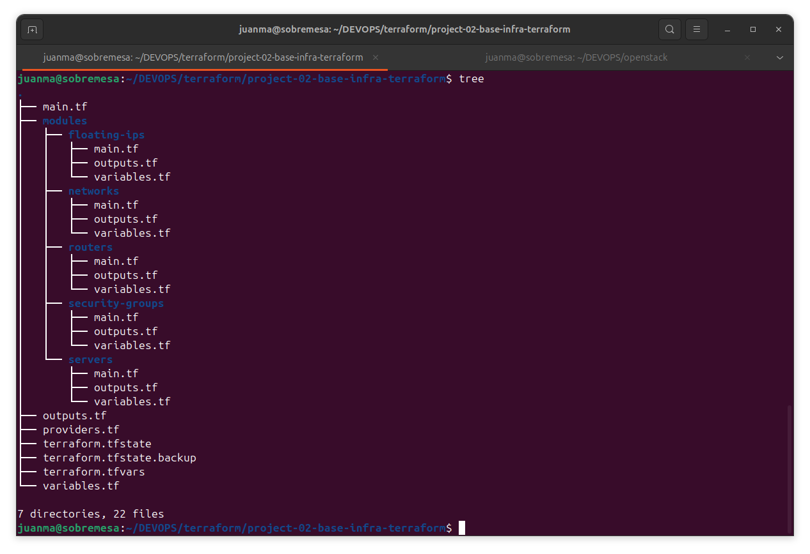

### 💡 Decisión de diseño clave: `terraform.tfvars`

Todos los valores (CIDRs, nombres, IPs, DNS, next hops) se definen en `terraform.tfvars` y fluyen a través de `variables.tf` hacia cada módulo. No existen valores hardcodeados en ningún módulo.

Esto convierte el proyecto en una **plantilla verdaderamente reutilizable**: para desplegar un entorno diferente, basta con usar un fichero `.tfvars` diferente:

```bash
terraform apply -var-file="terraform-pro.tfvars"
terraform apply -var-file="terraform-staging.tfvars"
```

---

## 🚀 Despliegue con Terraform

### Prerequisitos

- Credenciales OpenStack configuradas en `~/.config/openstack/clouds.yaml`
- Terraform 1.14.7 instalado
- Par de claves SSH disponible en `~/.ssh/id_rsa.pub`

> ⚠️ **Importante**: Este proyecto usa un flavor personalizado `m1.custom` (1 vCPU, 1024 MB RAM, 10 GB disco). Debe existir en OpenStack antes de ejecutar `terraform apply`. Créalo con:
> 
> ```bash
> openstack flavor create m1.custom --vcpus 1 --ram 1024 --disk 10 --public
> ```
> 
> Alternativamente, el flavor está definido en `flavors.tf` y será creado automáticamente por Terraform si no existe.

### Paso 1 — Topología vacía

Antes del despliegue, la topología de red de OpenStack está vacía:

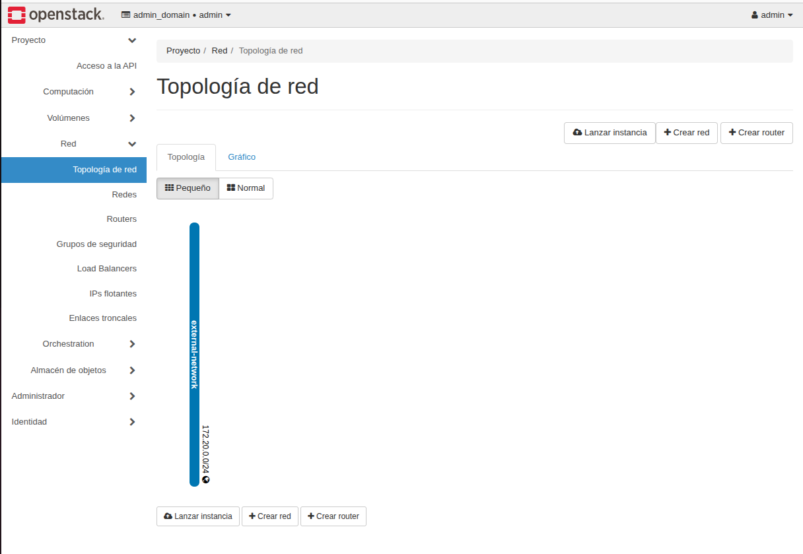

### Paso 2 — Inicializar Terraform

```bash
terraform init
```

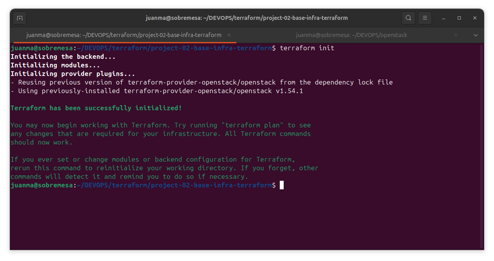

### Paso 3 — Revisar el plan

```bash
terraform plan
```

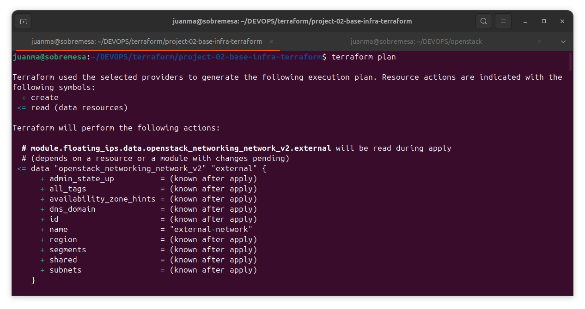

### Paso 4 — Aplicar la infraestructura

```bash
terraform apply
```

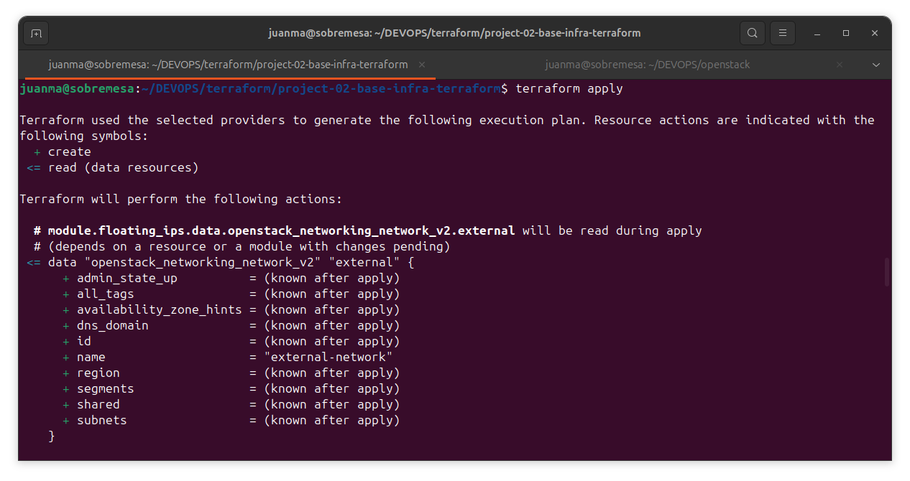

### Paso 5 — Topología de red tras el despliegue

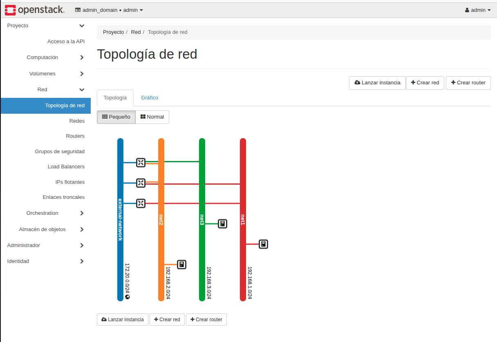

### Paso 6 — Revisar los outputs

```bash
terraform output
```

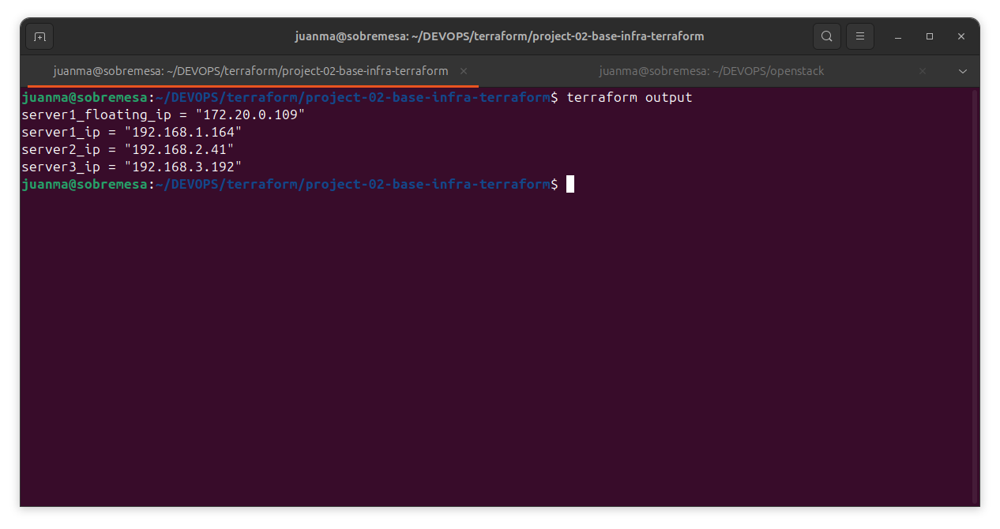

### Paso 7 — Verificar conectividad

```bash
ssh ubuntu@<floating_ip>
ping -c4 <server2_ip>
```

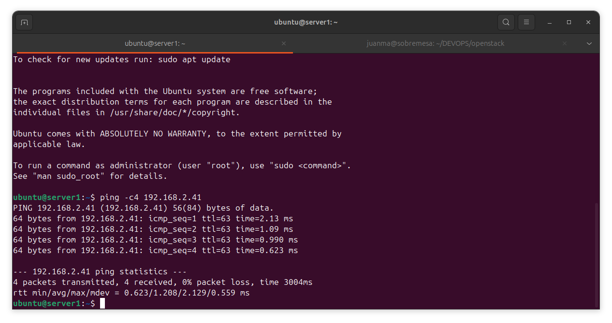

### Destruir la infraestructura

```bash
terraform destroy
```

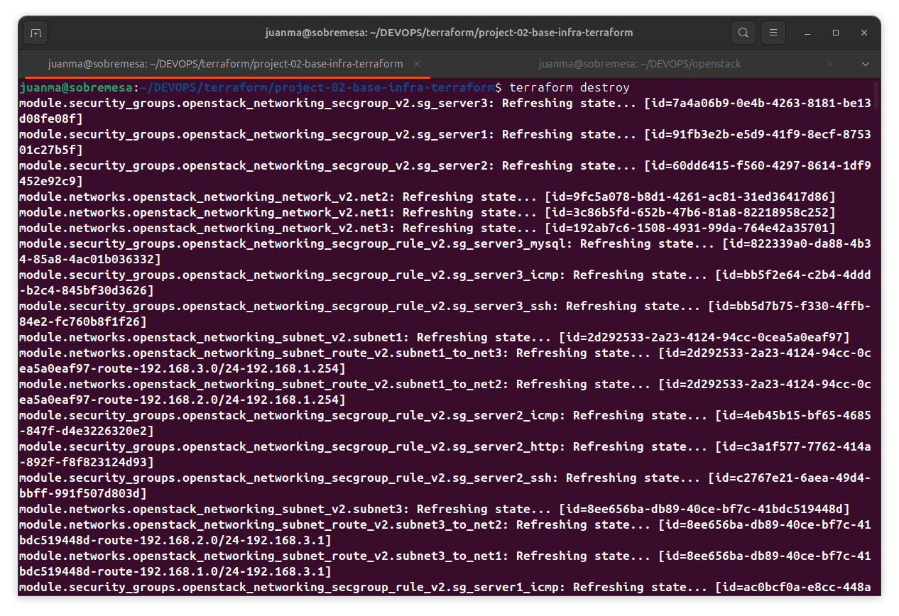

---

## 🔥 Despliegue con Heat

La misma infraestructura puede desplegarse usando OpenStack Heat. Sin embargo, se requieren algunos pasos adicionales antes de ejecutar los comandos Heat:

```bash
# Cargar credenciales OpenStack (necesario en cada nueva sesión de terminal)
source admin-openrc

# Consultar stacks existentes
openstack stack list

# Desplegar el stack
openstack stack create -t main.yaml test-stack

# Ver detalles del stack
openstack stack show test-stack
```

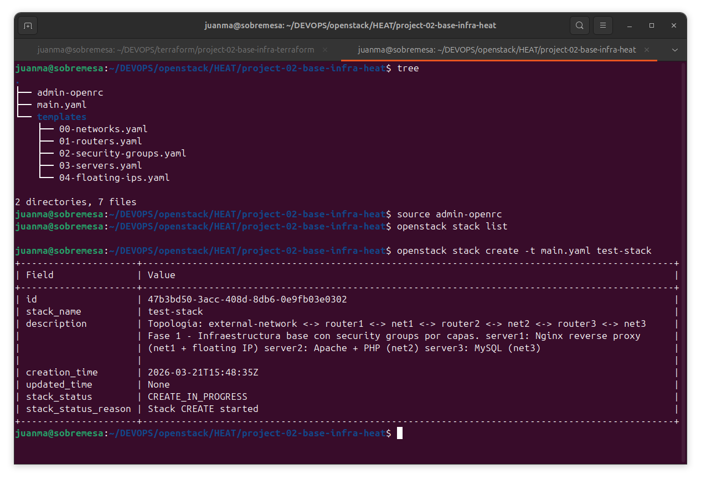

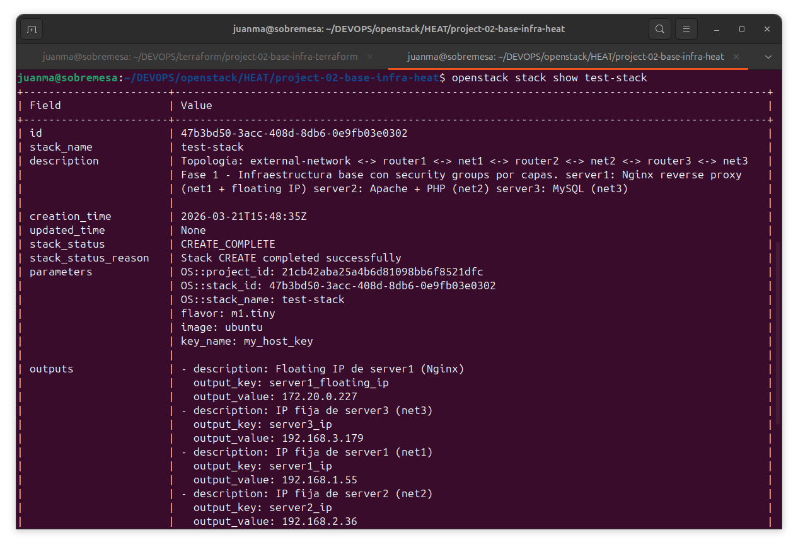

---

## ⚖️ Terraform vs Heat: Comparativa

| Característica        | Terraform                                             | Heat                                                           |
| --------------------- | ----------------------------------------------------- | -------------------------------------------------------------- |
| **Alcance**           | Multi-cloud (AWS, GCP, Azure, OpenStack...)           | Solo OpenStack                                                 |
| **Lenguaje**          | HCL (HashiCorp Configuration Language)                | YAML (formato HOT)                                             |
| **Modularidad**       | Módulos nativos, completamente reutilizables          | Limitada, plantillas monolíticas                               |
| **Gestión de estado** | `terraform.tfstate` rastrea el estado real            | Estado del stack gestionado por la API de Heat                 |
| **Idempotencia**      | Total — se puede re-ejecutar en cualquier momento     | Parcial — los fallos requieren `stack-update` o `stack-delete` |
| **Credenciales**      | `clouds.yaml` — configurado una sola vez              | `openrc` — hay que hacer source en cada sesión                 |
| **Recuperación**      | Re-ejecutar `terraform apply`, continúa donde lo dejó | Hay que borrar y recrear el stack                              |
| **Multi-entorno**     | `-var-file` para dev/staging/pro                      | Ficheros de plantilla separados                                |
| **Comunidad**         | Enorme ecosistema, miles de proveedores               | Específico de OpenStack                                        |

---

## 🧠 Conceptos clave

- **Idempotencia**: ejecuta `terraform apply` múltiples veces — Terraform solo cambia lo que es diferente. Con Heat, un despliegue fallido requiere intervención manual.

- **Modularidad real**: cada componente de infraestructura (redes, routers, grupos de seguridad, servidores) vive en su propio módulo con su propio `variables.tf`. Modifica uno sin tocar los demás.

- **Fuente única de verdad**: todos los valores fluyen desde `terraform.tfvars`. Para crear un entorno de producción con CIDRs y nombres de servidor diferentes, basta con crear `terraform-pro.tfvars`.

- **Firewall con estado**: los grupos de seguridad en OpenStack son stateful — el tráfico de retorno se permite automáticamente para conexiones establecidas. No es necesario definir reglas de egreso explícitas.

- **Rutas de gateway en la red**: cada red interna (net1, net2, net3) tiene una ruta de gateway configurada hacia la `external-network`. Esto es necesario para el enrutamiento entre redes a través de los routers de OpenStack y garantiza la conectividad completa entre las tres capas.

---

## 📚 Documentación oficial

- 🔗 Terraform: https://developer.hashicorp.com/terraform/docs
- 🔗 Proveedor Terraform OpenStack: https://registry.terraform.io/providers/terraform-provider-openstack/openstack/latest/docs
- 🔗 OpenStack Heat: https://docs.openstack.org/heat/latest/

---

## 👤 Información del autor

**Juan Manuel Payán Barea**
Administrador de Sistemas | SysOps | Infraestructura IT

st4rt.fr0m.scr4tch@gmail.com

GitHub: https://github.com/jpaybar
LinkedIn: https://es.linkedin.com/in/juanmanuelpayan
